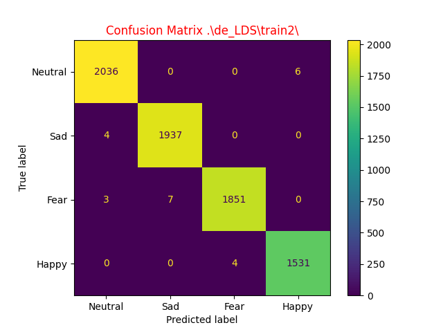

# EEG emotion recognition with GIN on dataset SEED-IV
EEG emotion recognition with graph isomorphism network (GIN) implemented in python.

## Summary
* 1. [Summary](#Summary)
* 2. [HOW TO RUN](#HOWTORUN)
* 3. [DEPENDENCIES](#DEPENDENCIES)
* 4. [HOW TO RUN TENSORBOARD](#HOWTORUNTENSORBOARD)
* 5. [METRICS OF OUR MODEL](#METRICSOFOURMODEL)
* 6. [RESULTS](#RESULTS)
	* 6.1. [Confusion Matrix of all training fold](#ConfusionMatrixofalltrainingfold)
	* 6.2. [Accuracy](#Accuracy)
	* 6.3. [Loss](#Loss)
* 7. [EXTERNAL REFERENCE](#EXTERNAL-REFERENCE)
* 7. [AUTHOR](#AUTHOR)

## HOW TO RUN
When the environment is already with all dependencies, you can run the python script with command:

```bash
python GIN.py --epochs <num of epochs> --dir <train output directory> --test
```

⚠: If you omitted the `--test` that value will be considered `false`, otherwise in each fold directory a file with all metrics information will be created and you can use this file in `metrics.py`.

## DEPENDENCIES
You must be prepare an environment *(PIP or ANACONDA)* with all necessary dependencies to execute the python script.

* `pytorch`
* `torcheeg`
* `torch_scatter`
* `torch_geometric`
* `tensorboard`
* `typing`
* `numpy`
* `rich`

## HOW TO RUN TENSORBOARD
You can see all training information with tensorboard, insert this command in another terminal:

```bash
python3 -m tensorboard.main --logdir=path/of/training/directory --bind_all --port=<number of port>
```

⚠: you must insert the `--bind_all` overall if you run the command in a remote terminal.

When you launch the command, you must open your browser and in URL area you must insert the domain and port specified in tensorboard. If you omitted the `--bind_all` your domain will be `localhost`.

## METRICS OF OUR MODEL
In this project a script for check the metrics of your model is included, the metrics that you can check are:

* *Confusion Matrix*
* *F1 Score*
* *Accuracy*
* *ROC-AUC Score*

USAGE:

```bash
python metric.py metrics_file_name <cm | roc | f1 | acc>
```

⚠: You can check only one metrics for run.

⚠: The files of metrics of each fold are in all `train#` directories, named `metrics_data`.

## RESULTS
Many experiments have been done, one of the best results was obtained with this parameters:

| Parameter | Value |
|:-----------:|:-------:|
| Epochs | 100 |
| Learning Rate | 0.0001 |
| Weight Decay | 0.0 |
| Bath Size | 256 |
| Features | Differental Entropy with LDS `[de_LDS]` |

### Confusion Matrix of all training fold





### Accuracy

**Accuracy FOLD #0**


**Accuracy FOLD #1**


**Accuracy FOLD #2**


**Accuracy FOLD #3**


**Accuracy FOLD #4**


### Loss

**Loss FOLD #0**


**Loss FOLD #1**


**Loss FOLD #2**


**Loss FOLD #3**


**Loss FOLD #4**


## EXTERNAL REFERENCE
[Torcheeg](https://torcheeg.readthedocs.io/en/latest/)

[Dataset SEED-IV](https://bcmi.sjtu.edu.cn/home/seed/seed-iv.html)

## AUTHOR
*Emilio Garzia, 2023*
